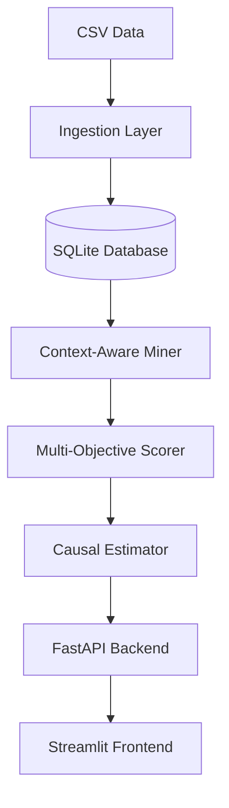

# ProfitLift System Design

## Architecture Overview

ProfitLift follows a modular architecture separating data ingestion, core analytics, and presentation layers.

## Component Structure

- **`app/ingest/`**: Handles CSV parsing, validation, and context enrichment (time bins, quarters).
- **`app/mining/`**: Implements FP-Growth and Eclat algorithms, plus the ContextSegmenter.
- **`app/score/`**: Contains ProfitCalculator, DiversityScorer, and MultiObjectiveScorer.
- **`app/causal/`**: Implements T-Learner and treatment simulation logic.
- **`app/api/`**: FastAPI routes and Pydantic models for serving data to the UI.
- **`app/ui/`**: Streamlit application with a custom premium theme.

## Data Flow

1. **Upload**: User uploads CSV via Streamlit.
2. **Ingest**: `CSVImporter` reads, validates, and writes to `transactions` and `items` tables in SQLite.
3. **Mine**: `ContextAwareMiner` reads from DB, segments data, and runs FP-Growth.
4. **Score**: Rules are scored based on profit, lift, and diversity.
5. **Estimate**: Top rules are passed to `CausalEstimator` to predict true uplift.
6. **Serve**: API returns JSON responses; UI renders interactive dashboards.

## Database Schema

- **items**: `item_id` (PK), `item_name`, `category`, `avg_price`, `margin_pct`
- **transactions**: `transaction_id` (PK), `timestamp`, `store_id`, `context_time_bin`, `context_quarter`
- **transaction_items**: Link table mapping transactions to items.

## API Design

- `POST /api/upload`: Ingest dataset.
- `GET /api/rules`: Retrieve filtered, scored rules.
- `GET /api/bundles`: Retrieve top bundle recommendations.
- `POST /api/whatif`: Run simulation for custom scenarios.
